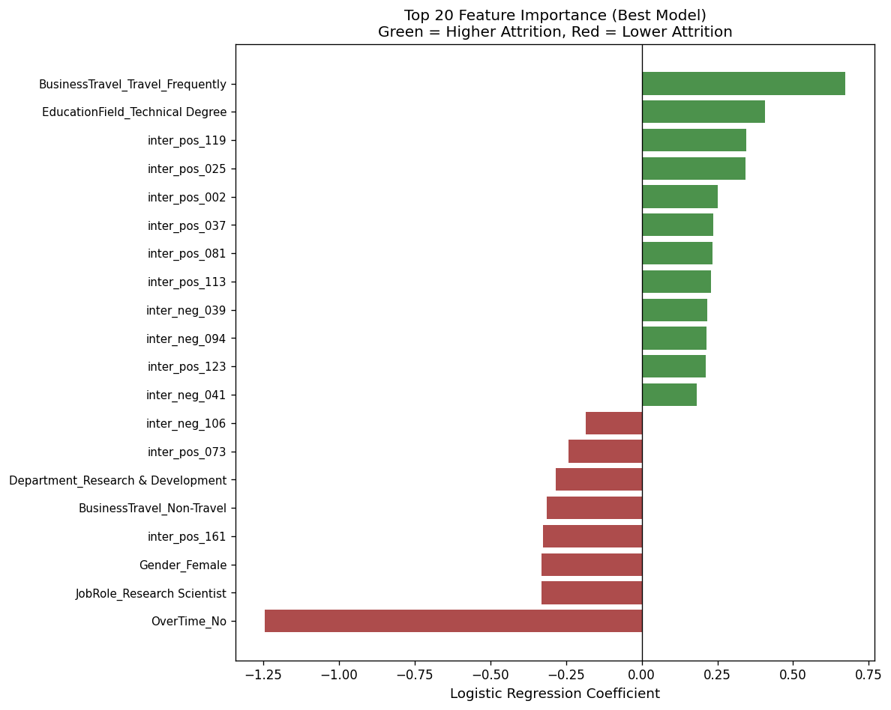

# Project Hackathon Employee Attrition Modeling

**Employee Attrition Modeling** is a comprehensive data analysis tool designed to streamline data exploration, analysis, and visualisation. The tool supports multiple data formats and provides an intuitive interface for both novice and expert data scientists.

# 

## Project Structure

```text
Hackathon-employee-attrition-modelling/
|-- Procfile
|-- README.md
|-- requirements.txt
|-- setup.sh
|-- data/
|   |-- Cleaned_dataset/
|   |   `-- WA_Fn-UseC_-HR-Employee-Attrition_capped.csv
|   `-- Raw_data/
|       `-- WA_Fn-UseC_-HR-Employee-Attrition.csv
|-- images/
|-- jupyter_notebooks/
|   |-- EDA.ipynb
|   |-- Feature_engineering.ipynb
|   |-- Stats_Tests.ipynb
|   `-- model/
```
# Team Members
    Role: PM / Scrum master
    Name: Ryan Brooker

    Role: ETL, EDA, ML  
    Name: Ezeokoronkwo Alban Chigozirim

    Role: Dashboard Design 
    Name: Sarika Morker

    Role: Documentation SME
    Name: Faithlynne Farrell-Walters

## Dataset Content

The dataset used in this project is the **IBM HR Employee Attrition dataset**, publicly available on Kaggle.

It contains information about employees within an organisation and includes demographic, professional, and financial variables that may influence whether an employee leaves the company.

The dataset contains approximately **1,470 employee records** and multiple attributes describing employee characteristics such as:

- Age
- Department
- Job Role
- Education Level
- Distance From Home
- Monthly Income
- Years at Company
- Job Satisfaction
- Work-Life Balance
- Attrition

The key variable in the dataset is **Attrition**, which indicates whether an employee has left the organisation. This allows the dataset to be used to analyse patterns associated with employee turnover and explore potential drivers of attrition.

The dataset was chosen because it provides a realistic HR scenario where data analytics can be used to support **workforce retention strategies and organisational decision-making**.

---

## Business Case Summary

Employee attrition can have significant costs for organisations, including recruitment expenses, productivity loss, and the loss of experienced staff. Organisations therefore benefit from understanding the factors that contribute to employees leaving.

This project analyses an **HR employee attrition dataset** to identify patterns and potential drivers of employee turnover. The main users of the insights generated by this project are:

- **HR departments**
- **Department managers**
- **Senior leadership teams**

These stakeholders are responsible for employee retention, workforce planning, and improving the overall employee experience.

By analysing trends in employee demographics, salary, commute distance, education level, and tenure, the project aims to identify patterns associated with higher attrition rates.

The dashboard and analysis allow decision-makers to explore these patterns and identify potential risk areas within the workforce. These insights can support HR teams in developing strategies that improve employee satisfaction and retention, ultimately helping organisations reduce recruitment costs and maintain organisational stability.

The project also explores several hypotheses around potential drivers of attrition, including factors such as:

- Distance From Home
- Monthly Income
- Education Level
- Years at Company

These hypotheses are tested through exploratory data analysis and visualisation.

---

## Feature Importance



---

## Hypothesis and how to validate?

> **Note:** Conclusions are preliminary due to time constraints and should be validated with further dedicated analysis.

The notebooks in this repository (`EDA.ipynb`, `Stats_Tests.ipynb`, `Feature_engineering.ipynb`) were not built to test these four hypotheses directly — they were built for data cleaning, statistical screening, and predictive modelling. However, by reading across the outputs produced, we can draw preliminary conclusions sufficient to provide a reasonable directional steer on each hypothesis.

### H1 — Does overtime impact attrition?

**Preliminary Conclusion:** Yes — and the effect is strong. But the expected direction is wrong.

The `Stats_Tests` notebook ran Mann-Whitney U tests across all categorical variables, and `OverTime` was one of only two variables to return statistically significant results. Reinforcing this, the modelling notebook identified `OverTime_No` as the single most influential predictor in the entire model. The weight of evidence is clear: **overtime workers are more likely to leave, not less.** The original hypothesis had the direction inverted.

> **Confidence: High** — supported by both independent statistical testing and the predictive model.

---

### H2 — Does frequent travel increase attrition?

**Preliminary Conclusion:** Yes — this is the most clearly confirmed hypothesis.

While the `Stats_Tests` notebook did not isolate a specific travel vs. attrition test, the modelling notebook provides strong indirect evidence. `BusinessTravel_Travel_Frequently` ranked as the second most impactful feature in the model, with a positive coefficient indicating employees who travel frequently are approximately **1.88× more likely to leave** once other factors are accounted for. The project's own executive summary calls out travel-heavy roles as the top retention risk.

> **Confidence: High** — the model evidence is direct and consistent.

---

### H3 — Do employees with technical degrees have higher attrition?

**Preliminary Conclusion:** Possibly — but the evidence is thin and inconclusive.

`EducationField_Technical Degree` appeared in the top 20 most important features in the model with a positive coefficient, pointing toward higher attrition risk. However, the statistical testing notebook found no significant result when education field was tested as a grouping variable. These two pieces of evidence pull in different directions, and given no dedicated test was run specifically for this hypothesis, no firm conclusion can be drawn from what is here.

> **Confidence: Low** — treat as a hypothesis worth properly testing, not a confirmed finding.

---

### H4 — Does gender influence attrition rates?

**Preliminary Conclusion:** No meaningful evidence to support this.

The `Stats_Tests` notebook ran 46 Mann-Whitney U tests using `Gender` as the grouping variable and returned **zero significant results**. Gender did appear in the model's top 20 features, but as a weak *protective* factor (women slightly less likely to leave) — the opposite of the typical assumption behind this hypothesis. On the evidence available, gender does not appear to be a meaningful driver of attrition in this dataset.

> **Confidence: Moderate** — statistical tests are clear, though a dedicated chi-square test on gender vs. attrition would formally close this out.

---

### Note on Methodology

These conclusions are drawn by cross-referencing outputs that were designed for other purposes — not from tests built specifically to answer these questions. A more rigorous investigation would dedicate a targeted analysis to each hypothesis. The data and tooling to do this properly is already in place in this repo, so the remaining work is focused analysis rather than starting from scratch.

## Project Plan
* The project was completed over four days using a structured and collaborative workflow. Regular morning meetings throughout the project ensured alignment, allowing the team to review progress, share findings, and make informed decisions on how to move forward toward completion.

- Day one, roles were assigned and the dataset was selected, while the project manager created a detailed project board to organise tasks and timelines. Each team member then worked independently on their assigned responsibilities, with progress shared during scheduled meetings. 

- Day two, exploratory data analysis (EDA) and ETL processes were completed, which informed the development of the project hypothesis. The business case summary was also defined and written, and the group collectively decided on the key outputs and visuals for the Power BI dashboard. 
- Day three involved continued development of the dashboard and Jupyter notebooks, alongside incremental updates to the README, with group discussions guiding next steps. 
- Day four, the focus shifted to consolidating all individual contributions and developing the final presentation slides. 

## Feature Importance: Business Insights

The model suggests that employee attrition is influenced by a combination of direct employee characteristics and more complex interactions between features. This indicates that attrition risk is not driven by one factor alone, but by how multiple factors combine in practice.

### Key Business Insights

#### 1. Frequent business travel is the strongest attrition risk factor
The most influential positive driver of attrition was **frequent business travel**. Employees who travel regularly appear to be at a much higher risk of leaving the organisation than those with less demanding travel requirements.

**Business implication:**  
This suggests that travel-heavy roles may require additional retention support, such as workload reviews, wellbeing check-ins, greater flexibility, or clearer progression incentives.

#### 2. Some education backgrounds show higher attrition risk
Certain education field categories, particularly **Technical Degree**, were associated with a higher likelihood of attrition in the model.

**Business implication:**  
This may indicate that employees from specific educational backgrounds have different expectations around career growth, role fit, or mobility. These groups may benefit from more targeted development and progression planning.

#### 3. Overtime patterns appear closely linked to retention
The model found that **not working overtime** was one of the strongest indicators associated with employees staying, which implies that employees working overtime may face a greater risk of attrition.

**Business implication:**  
This may reflect pressure, workload imbalance, or burnout risk. It suggests that overtime should be monitored carefully as a possible retention warning sign rather than treated purely as a productivity measure.

#### 4. Some departments and roles appear more stable
Employees in **Research & Development** and certain roles such as **Research Scientist** were associated with lower attrition risk.

**Business implication:**  
These areas may offer working conditions, role clarity, or progression pathways that support retention more effectively. This could provide a useful benchmark when reviewing teams with higher turnover.

#### 5. The model benefited from feature engineering
A large number of engineered interaction features were among the most influential predictors. This shows that attrition risk is affected not only by individual variables, but also by the way factors combine and interact.

**Business implication:**  
This strengthens the case for using data-led modelling rather than relying only on simple single-factor analysis. Employee turnover is likely shaped by overlapping pressures rather than isolated causes.

---

## Summary

Overall, the model indicates that attrition is most strongly associated with **frequent travel demands, overtime-related patterns, and certain employee background characteristics**, while some departments and roles appear more protective. The results also show that **interaction effects matter**, meaning the relationship between employee conditions is often more informative than looking at features in isolation.

From a business perspective, these findings suggest that retention strategies should focus on:

- employees in travel-heavy roles  
- teams or individuals with sustained overtime patterns  
- employee groups with elevated risk profiles based on education or role context  
- understanding how multiple workplace factors combine to influence turnover  

It is important to note that these feature importance results show **model associations rather than proof of causation**, but they provide a strong basis for further HR investigation and targeted retention planning.

## Models

This repository includes two pre-trained machine learning models, saved as pickle files in the `jupyter_notebooks/model/` directory:

### 1. **attrition_minority_yes_best_model.pkl**
The primary and best-performing predictive model for employee attrition. This model was trained and optimized to accurately predict whether an employee is likely to leave the organization. It incorporates all engineered features and represents the highest performing configuration based on the project's evaluation metrics.

### 2. **attrition_minority_yes_business_cost_second_best.pkl**
A secondary model optimized with business cost considerations in mind. This model balances predictive accuracy with real-world business constraints and may prioritize different aspects of model performance (e.g., reducing false negatives for high-risk employees).

Both models can be loaded and used for predictions on new employee data using Python's pickle library:

```python
import pickle

# Load the best model
with open('jupyter_notebooks/model/attrition_minority_yes_best_model.pkl', 'rb') as f:
    model = pickle.load(f)

# Make predictions
predictions = model.predict(new_employee_data)
```

## Ethical considerations
* The HR Employee Attrition dataset contains information about a business’s employees, such as age, gender, education, and monthly income. Although the data is anonymised and does not include personal information, there may still be a risk of bias. Variables like gender, education level, and income may introduce routine biases and lead to unfair or discriminatory outcomes if not handled thoughtfully. But this dataset was  analysed to see the positive and negative impacts on the attrition rate, so we can give insights on how to improve retention
The dataset was used in compliance with data protection standards (UK GDPR), ensuring that everything was anonymous and there were no attempts to identify individual workers. Also, it was used for academic outcomes.


## Dashboard Design
## Dashboard Screenshot


This single-page Power BI dashboard was designed to test four hypotheses related to employee attrition. It includes the following components:
Widgets and Layout

KPI Cards:
Total Employees
Attrition Count
Attrition Rate

Slicers:
Department
Job Level
Age Band

Visual Blocks:
Bar chart: Attrition Rate by Overtime
Bar chart: Attrition Rate by Business Travel
Bar chart: Attrition Rate by Education Field
Bar chart: Attrition Rate by Gender

Text Blocks:
Key Findings
Recommendations
Summary paragraph

Design Evolution
Initially, clustered column charts were planned for all visuals. During development, bar charts were used instead to improve readability and visual hierarchy. The slicer panel was added later to support interactive filtering across departments and job levels.

Communicating Insights to Technical and Non-Technical Audiences
Technical audience:
The dashboard includes precise attrition rates, segmented by categorical variables. Slicers allow analysts to drill down into specific employee groups. Tooltips and KPI cards provide quick access to key metrics.
Non-technical audience:
Each visual includes a short insight summarising the pattern (e.g., “Overtime employees leave at nearly 3× the rate of non-overtime employees”). Recommendations are written in plain language to support HR decision-making.

Design Strategy
The dashboard was designed to balance analytical depth with clarity. Visuals are grouped in a 2×2 grid to reflect the four hypotheses. Colour consistency, font alignment, and minimal text ensure readability. The layout supports both quick scanning and deeper exploration.

## Main Data Analysis Libraries

| Library | Purpose |
|---|---|
| `pandas` | Data loading, manipulation, and tabular analysis |
| `numpy` | Numerical operations and array handling |
| `matplotlib` / `seaborn` | Visualisation — distributions, heatmaps, and bar charts |
| `scikit-learn` | Machine learning — logistic regression, gradient boosting, pipelines, preprocessing, and model evaluation |
| `pingouin` | Statistical testing — Mann-Whitney U tests across categorical variables |
| `feature-engine` | Feature engineering — outlier capping via Winsorizer |


## Unfixed Bugs
At the current stage of the project, there are no major known bugs that prevent the main workflow from running as intended. The notebooks are separated by stage and the core outputs are saved into structured folders for reuse.

## Development Roadmap

* Time issues 
* Conflicts over interviews, asessments during day 3 and day 5
* First time working on a project as a group. 
* Spent a long time working out roles and duties. 

## Deployment

### Clone the repo
```bash
git clone https://github.com/RNB1993/Hackathon-employee-attrition-modelling.git
```
#### Install dependencies
```bash
pip install -r requirements.txt
```

## Credits 
IBM HR Employee Attrition dataset  https://www.kaggle.com/datasets/pavansubhasht/ibm-hr-analytics-attrition-dataset 


## Acknowledgements
* Thanks to the instructors (Vasi, Mark, and Neil), walkthrough materials, and feedback sources that supported the development of this project, as well as the broader learning content that helped shape the analytical and ethical approach used throughout.
